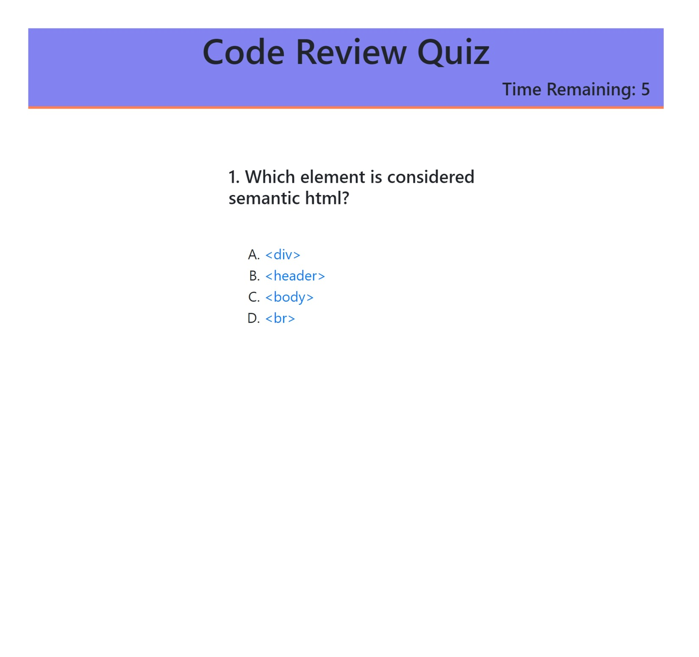
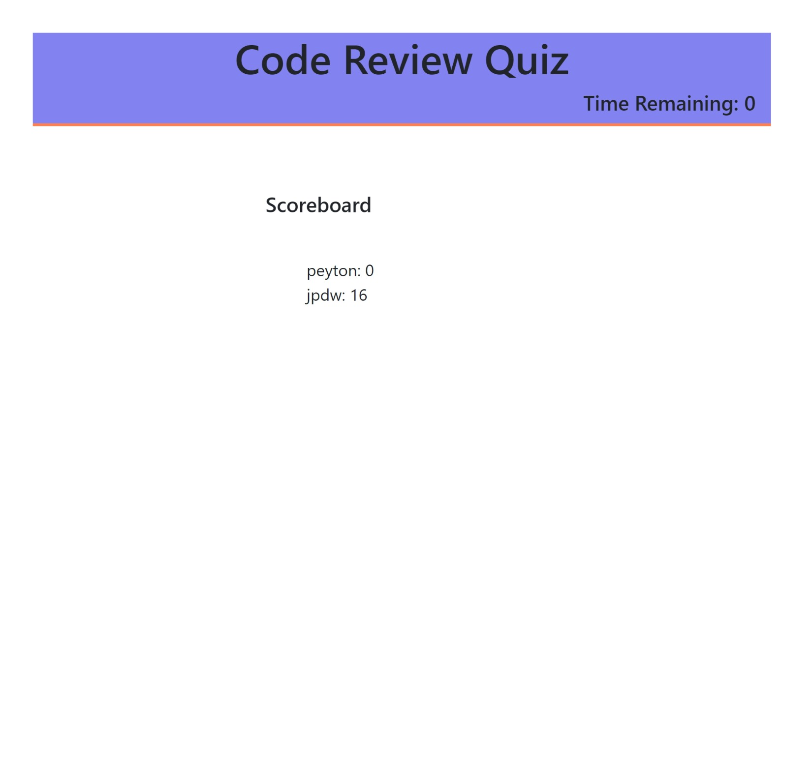

>### Quiz Time!
---
#### For this small project I was tasked with creating a breif coding quiz for students to take. the quiz has four simple coding review questions and records your score by timing you on its completion! The scores are added to local storage and then populated on a scoreboard after the quiz is finished.
---

>### Features
- A start button in the form of an alert.
- A running score board which allows for initials to tracl your progress and compare your score with others
- Good examples of DOM manipulation using vanilla JavaScript in the source code!
---
here is a screenshot and link to the site below.
 
 [Code Quiz Site](https://jpeyton-hub.github.io/CodingQuiz/#)

 

 